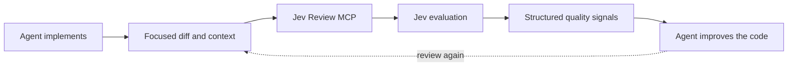

# Jev Review

<div align="center">

**Continuous software-quality review for AI coding agents, powered by [Jev](https://typesafe.ai/).**

[](LICENSE)


[Quick start](#quick-start) · [Client setup](#client-setup) · [Quality dimensions](#quality-dimensions) · [Security](#security-and-privacy)

</div>

Jev Review runs as a local MCP server and gives Claude Code, Codex, Cursor, and OpenCode structured quality scores while they work. Your coding agent remains responsible for diagnosing weaknesses and changing the code; Jev supplies a fast scalar signal across correctness, complexity, changeability, modularity, tests, security, and other independent quality dimensions.

> [!IMPORTANT]
> **Your API key stays on your machine.** Jev Review has no hosted backend, database, telemetry service, or author-operated proxy. The only remote request is sent directly to the configured Jev API.

> [!NOTE]
> **About this fork.** Jev is a classifier, not a reasoner. Measured against known bug/fix pairs, generic quality questions about a bare diff could not tell a bug from its fix, while a pointed question about a rule that is written down separated the same pairs cleanly (bug 0.72–0.95, fix 0.05–0.09). This fork adds a second tool, [`jev_rules`](#rules-check), that checks a diff against your personal rules and the repository's rules, and reorients the skill around it.

## Demo

<p align="center">
  

https://github.com/user-attachments/assets/0ff9f873-0652-4826-af3d-6bb4f42c70b1


</p>

## At a glance

| | |
| --- | --- |
| **Purpose** | Continuous, structured software-quality evaluation |
| **Supported clients** | Claude Code, Codex, Cursor, OpenCode |
| **Distribution** | This GitHub repository—no npm publication |
| **Runtime** | Local Node.js process over MCP stdio |
| **Remote access** | Direct requests to Jev using your API key |
| **MCP tools** | `jev_rules` (check a diff against written rules) and `jev_review` (scorecard) |
| **Code changes** | Always performed by the primary coding agent |

## Quick start

Requirements:

- Node.js 20 or newer
- A Jev API key from the [TypeSafe console](https://console.typesafe.ai/)
- Claude Code, Codex, Cursor, or OpenCode

Set your API key before starting the coding agent:

```bash
export JEV_API_KEY="your-key"
```

Install Jev Review directly from GitHub—no npm publication is required:

```bash
npx plugins add NiazMorshed2007/jev-review
```

Choose your coding client when prompted, restart it, and ask the agent to use `jev-review` while implementing a nontrivial change.

## How it works



Jev Review is intended for frequent, focused checkpoints: after a coherent implementation slice, after a score-driven improvement, and before final handoff. The first call establishes a baseline. The agent then inspects its own implementation, forms a hypothesis about weak dimensions, improves the code, validates it, and rescores.

Jev returns typed Score, Choice, and Noul decisions rather than a free-form review essay. It does not generate a prose explanation of why a score is low. Jev Review validates and converts those decisions into metric scores, confidence levels, coarse rubric hints, and comparisons with a previous evaluation. The coding agent—not Jev—must determine the actual cause and appropriate code change.

There is deliberately no synthetic “82/100” overall score. Dimension changes such as `Readability 6.3 → 8.1` and `Security 8.2 → 8.2` are more useful than a blended percentage.

## Client setup

| Client | Plugin installation | Manual MCP available |
| --- | --- | --- |
| Claude Code | `npx plugins add NiazMorshed2007/jev-review --target claude-code` | Yes |
| Codex | `npx plugins add NiazMorshed2007/jev-review --target codex` | Yes |
| Cursor | `npx plugins add NiazMorshed2007/jev-review --target cursor` | Yes |
| OpenCode | Manual configuration below | Yes |

Every client starts the same bundled `dist/server.js` process locally over stdio.

### Claude Code

```bash
npx plugins add NiazMorshed2007/jev-review --target claude-code
```

Restart Claude Code and run `/mcp` to confirm that `jev-review` is connected.

To load a local clone while developing:

```bash
claude --plugin-dir /absolute/path/to/jev-review
```

Manual MCP-only setup:

```bash
claude mcp add --scope user jev-review -- node /absolute/path/to/jev-review/dist/server.js
```

### Codex

```bash
npx plugins add NiazMorshed2007/jev-review --target codex
```

Restart Codex and run `/mcp` to verify the connection.

Manual setup in `~/.codex/config.toml`:

```toml
[mcp_servers.jev-review]
command = "node"
args = ["/absolute/path/to/jev-review/dist/server.js"]
env_vars = ["JEV_API_KEY"]
```

### Cursor

```bash
npx plugins add NiazMorshed2007/jev-review --target cursor
```

Restart Cursor and check **Settings → MCP**. The bundled skill is named `jev-review`; invoke it with `/jev-review` or leave it on **Agent Decides**.

Manual setup in `~/.cursor/mcp.json`:

```json
{
  "mcpServers": {
    "jev-review": {
      "type": "stdio",
      "command": "node",
      "args": ["/absolute/path/to/jev-review/dist/server.js"],
      "env": {
        "JEV_API_KEY": "${env:JEV_API_KEY}"
      }
    }
  }
}
```

If Cursor is launched from the macOS Dock, it may not inherit variables from your shell profile. Make the already-exported key available to GUI applications before starting Cursor:

```bash
launchctl setenv JEV_API_KEY "$JEV_API_KEY"
```

Verify without printing the key:

```bash
test -n "$(launchctl getenv JEV_API_KEY)" && echo "JEV_API_KEY is configured"
```

### OpenCode

OpenCode does not currently appear in the portable `plugins` installer targets. Point it at the same bundled server instead:

```bash
git clone https://github.com/NiazMorshed2007/jev-review.git
cd jev-review
opencode mcp add jev-review --global -- node "$PWD/dist/server.js"
```

For the full skill and MCP setup, add this to `~/.config/opencode/opencode.json`, replacing the absolute path:

```json
{
  "$schema": "https://opencode.ai/config.json",
  "skills": ["/absolute/path/to/jev-review/skills"],
  "mcp": {
    "servers": {
      "jev-review": {
        "type": "local",
        "command": ["node", "/absolute/path/to/jev-review/dist/server.js"],
        "environment": {
          "JEV_API_KEY": "{env:JEV_API_KEY}"
        }
      }
    }
  }
}
```

Run `opencode mcp list` to verify the connection. OpenCode may display the tool as `jev-review_jev_review`; the underlying MCP tool is still `jev_review`.

## Rules check

`jev_rules` asks Jev one yes/no question per rule, per changed file, and returns the likely violations as `probability`, rule id, and file.

Rules are plain JSON and come from up to three places, later overriding earlier by `id`:

| Source | Path | Use for |
| --- | --- | --- |
| Personal | `~/.jev/rules.json` | Principles you want enforced in every repository |
| Repository | `<repo>/.jev/rules.json` | That codebase's invariants; commit it so the whole team and every agent share them |
| Inline | the tool's `rules` argument | Calibrating or trying out a rule |

```json
{
  "rules": [
    {
      "id": "never-swallow-errors",
      "paths": "optional regex on the changed file's path",
      "rule": "What is forbidden, why (the failure it causes), and what to do instead."
    }
  ]
}
```

[`examples/rules.example.json`](examples/rules.example.json) is a starter set to copy. A rule discriminates when it names the concrete APIs a violation would contain, covers one concern, and states its exemptions; `paths` is the main false-positive control. Calibrate a new rule by calling `jev_rules` with `diff`, `rules`, and `includeAll` twice, once with a violating diff and once with the fixed one, and keep it when they score about 0.7 or higher and 0.3 or lower.

```ts
{
  repoRoot?: string;   // loads <repoRoot>/.jev/rules.json; without `diff`, runs `git diff <base>` here
  base?: string;       // default "HEAD"; use the branch base to check a whole branch
  diff?: string;       // check this diff instead of the working tree
  rules?: Rule[];      // inline rules
  threshold?: number;  // default 0.6
  includeAll?: boolean // also return every probability, not only hits
}
```

A file whose diff exceeds 100 KB is skipped and listed in `skippedFiles`. Untracked files are not part of `git diff`. A failed request is an error, never a clean result.

## Scorecard tool

`jev_review` scores generic quality dimensions. Without the relevant rules in `repositoryContext` it is a coarse signal: run-to-run noise is about ±0.3.

```ts
{
  task?: string;
  diff?: string;
  files?: Array<{
    path: string;
    content: string;
  }>;
  repositoryContext?: string;
  previousEvaluation?: Evaluation;
}
```

At least one current-context field is required. Callers should normally send the task and focused diff, adding complete files only when the surrounding implementation is necessary to understand the change. `jev_review` never reads the repository itself.

Jev Review does not impose an additional character, token, or file-count limit. The Jev API currently enforces its own token ceiling: live `jev-latest` behavior indicates roughly 32,768 tokens for the submitted state, although this number is not published in the API documentation or OpenAPI schema and may change. When Jev returns `max_tokens_exceeded`, the server asks the agent to reduce unrelated context or split the change into coherent review slices.

The response contains:

- An independent 1–10 score and 0–1 confidence for each applicable metric
- `{ "applicable": false }` for dimensions unsupported by the supplied context
- Prioritized weak dimensions and coarse predefined rubric hints—not generated root-cause explanations
- Per-metric deltas, improvements, regressions, and unresolved weaknesses when `previousEvaluation` is supplied

## Quality dimensions

Always evaluated when the supplied context is sufficient:

- Correctness and requirement fit
- Cognitive complexity
- Readability and intent
- Modularity and cohesion
- Coupling and dependency quality
- Changeability and change amplification
- Abstraction and API design
- Project and file structure
- Duplication and reuse
- Maintainability
- Testability and test quality
- Reliability and error handling
- Security
- Consistency and conventions
- Documentation and explainability

Evaluated only when relevant evidence is present:

- Performance and resource efficiency
- Scalability and flexibility
- Compatibility and API stability
- Observability and operability

The evaluator judges consequences in context. It does not assume short functions, small files, zero duplication, more layers, more comments, or more tests are automatically better.

## Evaluation workflow

The included `jev-review` skill teaches agents to treat Jev as a repeated scalar feedback loop:

1. Understand the task and inspect the repository.
2. Implement a coherent change and run relevant checks.
3. Call `jev_review` with focused context to establish a baseline.
4. Inspect the code themselves and form a hypothesis for weak important scores.
5. Make the smallest justified improvement and validate it.
6. Rescore with `previousEvaluation`, then inspect improvements and regressions.
7. Repeat while another evidence-based improvement remains.
8. Stop when requirements and checks pass and further score-seeking would add little real value.

Correctness and the user's requirements always outrank score improvement. A higher score never justifies speculative architecture, unnecessary abstraction, scope expansion, breaking behavior, meaningless tests, or needless rewrites.

## Architecture

```text
jev-review/
├── plugin.json                  # Portable Agent Plugin manifest
├── mcp.json                     # Portable stdio MCP definition
├── .claude-plugin/
│   └── plugin.json              # Claude Code adapter
├── .codex-plugin/
│   └── plugin.json              # Codex metadata
├── skills/
│   └── jev-review/
│       └── SKILL.md             # Agent review workflow
├── src/
│   ├── config/                  # Environment handling
│   ├── evaluation/              # Metrics, scoring, and comparisons
│   ├── jev/                     # Direct Jev client and validation
│   └── mcp/                     # MCP tool boundary
├── dist/
│   └── server.js                # Committed standalone server bundle
├── public/
│   └── jev-review-demo.mp4      # Product demonstration
└── test/                        # Unit and MCP protocol tests
```

`plugin.json` and `mcp.json` are the portable [Agent Plugins 1.0](https://agent-plugins.org/specification) package. `.claude-plugin/plugin.json` and `.mcp.json` provide Claude Code compatibility, while `.codex-plugin/plugin.json` supplies Codex metadata. These are small packaging adapters around one MCP implementation.

## Development

```bash
git clone https://github.com/NiazMorshed2007/jev-review.git
cd jev-review
npm install
npm run validate
```

Useful commands:

```bash
npm run check
npm test
npm run build
npx plugins discover .
claude plugin validate . --strict
```

`npm run build` creates the committed `dist/server.js` bundle. Unit and MCP protocol tests use local fakes and do not consume Jev API quota; a live Jev call requires `JEV_API_KEY`.

## Security and privacy

The local MCP process reads `JEV_API_KEY` and uses it only in the TLS Authorization header sent directly to `https://api.typesafe.ai/v1/systemone`. Jev Review never stores or logs the key.

Only the `task`, `diff`, `files`, and `repositoryContext` explicitly supplied to `jev_review` are sent to Jev. `previousEvaluation` is compared locally and is not included in the current code context. `jev_review` discovers and uploads nothing on its own. `jev_rules` reads only `~/.jev/rules.json` and `<repoRoot>/.jev/rules.json`, and when called with `repoRoot` and no `diff` it runs `git diff <base>` there and sends that diff, one changed file per request, along with the rule text.

Review context does leave your machine for TypeSafe's Jev API. Do not supply secrets or unrelated proprietary content, and review [TypeSafe's privacy policy](https://typesafe.ai/privacy) for the remote service's handling terms. Jev Review complements rather than replaces dedicated security tooling.

## License

[MIT](LICENSE)
